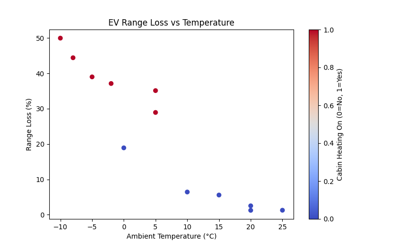

# EV Range in Cold Weather ❄️🔋  

This project investigates how **low ambient temperatures** affect the driving range of electric vehicles (EVs). The analysis is based on sample data and demonstrates how to quantify range loss, visualize results, and interpret findings.  

---

## 📌 Background  

Cold weather has been observed to **significantly reduce EV range**, often due to increased energy demands from **battery chemistry inefficiency** and **cabin heating systems**. Studies show losses of **20–50%** in real-world conditions.  

This project replicates that effect using synthetic but realistic data, and evaluates how range loss scales with ambient temperature.  

---

## 📊 Data  

The dataset (`data/ev_data_sample.csv`) contains:  
- **Ambient Temperature (°C)**  
- **Battery Range (km)**  
- **Cabin Heating (0 = off, 1 = on)**  

Example (first 5 rows):  

| Temperature (°C) | Range (km) | Cabin Heating |
|------------------|------------|---------------|
| -10              | 220        | 1             |
| -5               | 240        | 1             |
| 0                | 300        | 0             |
| 5                | 310        | 0             |
| 20               | 400        | 0             |

---

## ⚙️ Methodology  

1. Load EV dataset (CSV)  
2. Compute **percentage range loss** compared to baseline (warm weather, ~25°C)  
3. Visualize the relationship between temperature and range loss  
4. Highlight the effect of **cabin heating** as a binary feature  

---

## 📈 Results  

Example result when running the analysis:  

  

- At **-10°C with heating**, range drops by nearly **50%**  
- Without heating, the loss is closer to **25%**  
- On average, the dataset shows **~22.5% range loss** across cold conditions  

---

## 🔎 Discussion  

- **Battery chemistry**: Li-ion batteries lose efficiency in cold weather due to slower electrochemical reactions  
- **Cabin heating load**: Electric heating consumes significant energy, amplifying range loss  
- **Limitations**: The dataset is synthetic and simplified; real-world data would include additional variables (wind, driving speed, regenerative braking)  

---

## 🚀 Future Work  

- Collect real-world driving datasets across climates  
- Compare different regression models (linear vs polynomial vs machine learning)  
- Incorporate **humidity, wind, and road conditions**  
- Explore mitigation strategies (e.g., heat pumps, preconditioning)  

---

## 🛠️ How to Run  

```bash
pip install -r requirements.txt
python analysis.py
